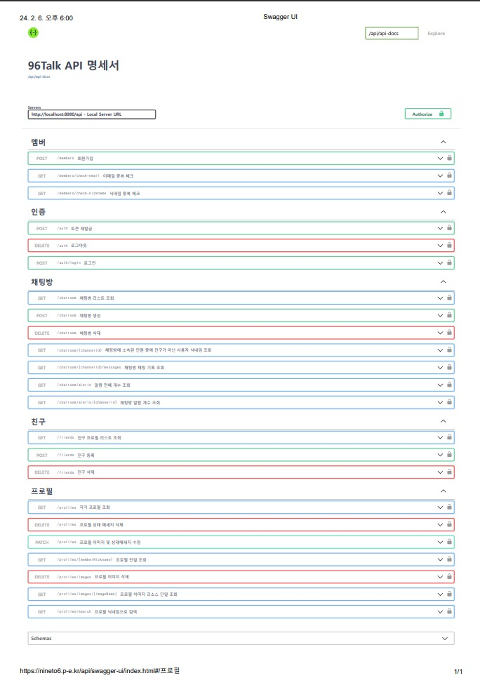
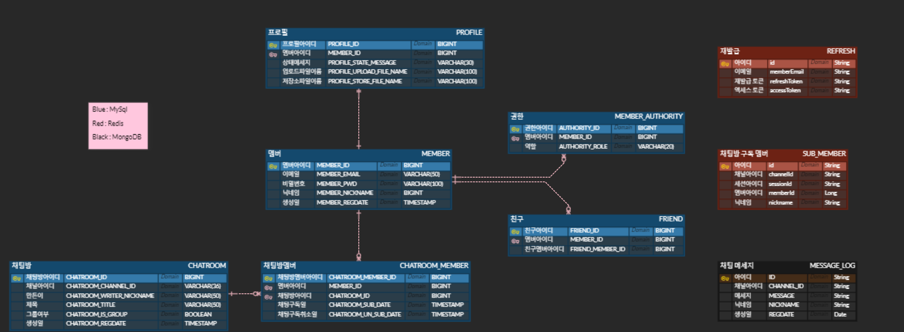

## 96TALK 🕤 - 양방향 통신 웹 메신저 서비스 📨

> 2023 서일대학교 NINETO6 팀 프로젝트

 

### 🧑‍💻 팀원 소개

<table>
  <tr>
  <td align="center">
	    <a href="https://github.com/chang-seop">
	    	
	    	 
	    	
	    	<b>신창섭</b>
	    	 
	    	
	        
	    </a>
	     
	</td>
  <td align="center">
	    <a href="https://github.com/ezurno">
	    	
	    	 
	    	
	    	<b>이준모</b>
	    	 
	    	
	        
	    </a>
	</td>
  </tr>
</table>

 

### ⚡프로젝트 소개

> 2023.06 - 2023.11

**양방향 통신 웹 메신저 서비스**

평소에 자주쓰던 'KAKAOTALK', 'LINE' 을 보며 웹에서도 구현해볼 수 있을까? 라는 의문에 시작하게 된 프로젝트.

웹 브라우저에는 채팅방을 생성하여 실시간으로 채팅할 수 있는 플랫폼이 많이 없다고 생각했었는데

비 연결성 프로토콜인 `Http` 통신 방식에 관해 공부하고 있던 중 `Websocket` 과 같은 양방향 네트워크 프로토콜 기반으로 동작하는

`Simple Text Oriented Messaging Protocol(STOMP)`에 대해 알게 되어 구현해 보고자 했다.

 <ul>
  <li>실시간으로 서로의 채팅을 볼 순 없을까? 연결형 프로토을 사용하자!</li>
  <li>전송 후에 연결이 끊기는 `HTTP` 를 유지 할 순 없을까? `WebSocket` 을 활용하자! 클라이언트와 서버 간에 데이터를 양방향으로 전송</li>
  <li>메세지를 보냄으로서 생기는 지연은 어떻게 해결할까? `Message Broker` 를 사용하자!</li>
</ul>

 

### ⚙️ 기술 정보

#### Frontend

#### Backend

#### Tool

 

### 🚧 버전 관리 및 진행

#### Ver 1.0

- [x] DB 및 ERD-CLOUD 설계
- [x] Token Hiding
- [x] Refreash Token 구현
- [x] SSL, TLS 인증서 등록 (HTTPS)
- [x] Security 추가
- [x] JWT 인증 방식 추가
- [x] Web Server Engine X 설정
- [x] Swagger 로 관리
- [x] 프로필 수정, 프로필 상세 메세지
- [x] 친구추가 및 채팅방 개설 구현
- [x] 친구목록 조회
- [x] 채팅리스트 조회
- [x] 실시간 채팅 구현
- [x] 채팅 버블 및 안읽은 채팅 표시 구현
- [x] 알람기능 구현
- [x] 각 요청 Validation

#### Ver 2.0

- [ ] 채팅 메세지 Lazy-Loading 구현
- [ ] 단체 채팅방
- [ ] 이미지 업로드 ( 30일 뒤 제거 배치 후순위 )

 

### 🔍 프로젝트 상세

#### Swagger

[Swagger API 명세서](https://nineto6.p-e.kr/api/swagger-ui/index.html#/)

#### ERD-Cloud

 

### 🌳 개발 환경

#### Frontend

- Project: React ^18.2.0
- Language: typescript ^4.9.5
- Dependencies
  - react-hook-form: ^7.48.2
  - react-helmet: ^6.1.0
  - axios: ^1.6.1
  - sockjs-client: ^1.6.1
  - @stomp/stompjs: ^7.0.0
  - tailwindcss: ^3.3.5

#### Backend

- Project: Gradle
- SpringBoot: 2.7.17
- Language: Java 11
- Dependencies
  - jjwt: 0.9.1
  - json-simple: 1.1.1
  - jaxb-runtime: 2.3.2
  - springdoc-openapi-ui: 1.7.0
  - mybatis-spring-boot-starter:2.3.1
  - spring-boot-starter-security
  - spring-boot-starter-web
  - spring-boot-starter-websocket
  - spring-boot-starter-validation
  - spring-boot-starter-data-mongodb
  - spring-boot-starter-data-redis
  - spring-boot-starter-test
  - mysql-connector-j
  - lombok

 
